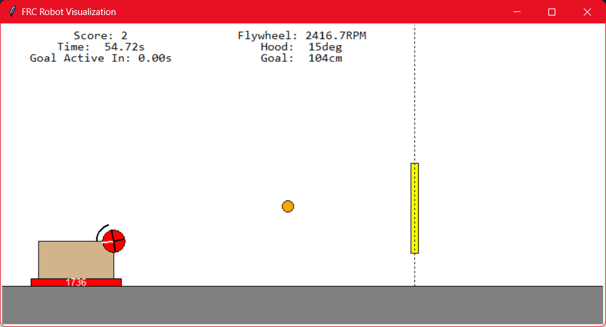

# Flywheel Launcher Exercise

## The Game

This programming exercise is writing robot code for a simple game.

Your goal is to score as many points as possible.

Points are achieved by launching a ball through a vertical goal.

Points are only awarded if the ball goes through the goal _while it is active_.

The goal will move up and down randomly, and activate at random intervals.

## Your Code

You should put all your new code in `robot.py`. You have a `robotInit()` method for one-time init operations, and a `robotPeriodic()` method which runs once every 20ms.

In `robotPeriodic()`, you _must_ calculate the following outputs:

1. Flywheel Motor Voltage (0 to 12v) - voltage to apply to the flywheel motor. Positive voltage increases flywheel speed.
2. Hood Adjust Motor Voltage (-12 to 12v) - voltage to apply to the hood motor. Positive voltage extends the hood over the top of the wheel.
3. Launch Command (boolean) - Set to `True` to command the ball to be launched.

Additionally, you get the following inputs from sensors and the field:

1. Current Hood Angle (degrees up or down from vertical) - angle the hood will launch the ball at. It can rotate +/- 60 degrees. 0 is flat, positive is upward, negative is downward.
2. Current Flywheel Speed in RPM - Speed of the flywheel. Maximum is roughly 5000RPM.
3. Time until goal active - Duration until the goal goes active. Usually between 1 and 3 seconds. If this number is zero, the goal is active now.
4. Current Goal Height in cm - Current height of the goal, in centimeters.

## Get Started

1. Clone this repo, make a new branch for your development
2. Run the base code by double-clicking `run.bat`, or by running it in debug in vscode.
3. Add your logic to robot.py to score more points.